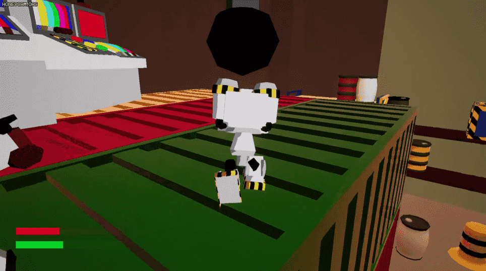
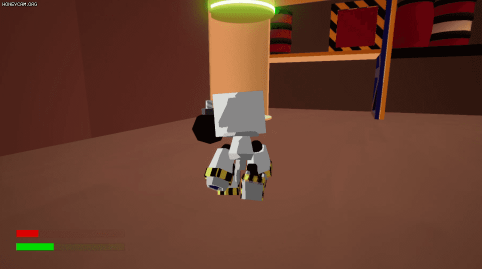
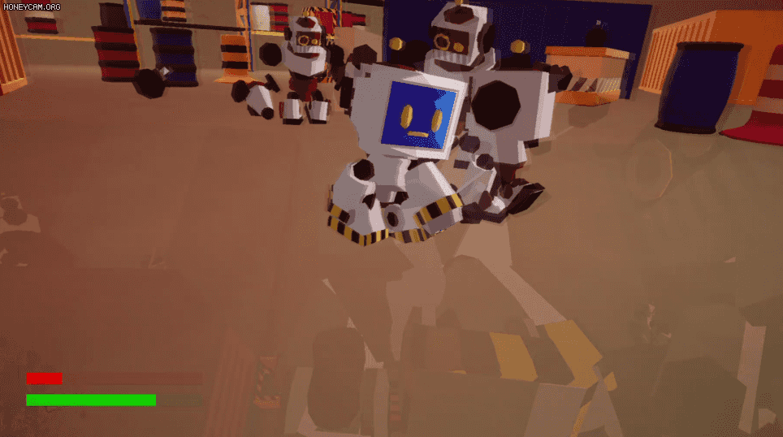

# CatInTheMachine

-- Description -- 

1. 다운로드 및 실행

 - https://drive.google.com/file/d/1tZSMR3uh1LlKw6xuJtN-NVKG0eBkcYOA/view?usp=sharing 에서 게임 다운로드
 - 압축 해제 후 Test_Test 파일 실행

2. 조작

 - WASD로 이동
 - Shift키를 누르고 있는 동안 달리기 (좌하단 녹색 게이지 소모)
 - E키로 폭탄과 상호작용 (1회 -집기, 2회 - 던지기)

3. 플레이 스크린 샷

4. 팀원 깃허브 Link

안정근 : https://github.com/wingker2

이다흥 : https://github.com/heungdol
